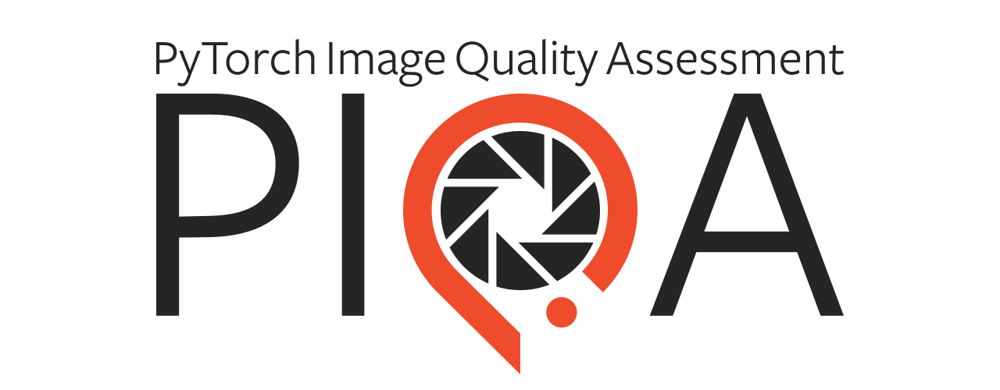
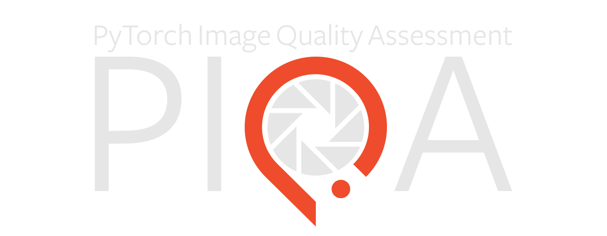

PIQA
====

PIQA is a collection of PyTorch metrics for image quality assessment in various image processing tasks such as generation, denoising, super-resolution, interpolation, etc. It focuses on the efficiency, conciseness and understandability of its (sub-)modules, such that anyone can easily reuse and/or adapt them to its needs.

Installation
------------

The :mod:`piqa` package is available on `PyPI <https://pypi.org/project/piqa>`_, which means it is installable via `pip`.

.. code-block:: console

    pip install piqa

Alternatively, if you need the latest features, you can install it from the repository.

.. code-block:: console

    pip install git+https://github.com/francois-rozet/piqa

Getting started
---------------

In :mod:`piqa`, each metric is associated to a class, child of :class:`torch.nn.Module`, which has to be instantiated to evaluate the metric. All metrics are differentiable and support CPU and GPU (CUDA).

.. code-block:: python

    import torch
    import piqa

    # PSNR
    x = torch.rand(5, 3, 256, 256)
    y = torch.rand(5, 3, 256, 256)

    psnr = piqa.PSNR()
    l = psnr(x, y)

    # SSIM
    x = torch.rand(5, 3, 256, 256, requires_grad=True).cuda()
    y = torch.rand(5, 3, 256, 256).cuda()

    ssim = piqa.SSIM().cuda()
    l = 1 - ssim(x, y)
    l.backward()

Like :mod:`torch.nn` built-in components, these classes are based on functional definitions of the metrics, which are less user-friendly, but more versatile.

.. code-block:: python

    from piqa.ssim import ssim
    from piqa.utils.functional import gaussian_kernel

    kernel = gaussian_kernel(11, sigma=1.5).repeat(3, 1, 1)
    ss, cs = ssim(x, y, kernel=kernel)

For more information, check out the `API <api.html>`_ or the `repository <https://github.com/francois-rozet/piqa>`_.

.. toctree::
    :caption: piqa
    :hidden:
    :maxdepth: 2

    api.rst

.. toctree::
    :caption: Development
    :hidden:
    :maxdepth: 1

    Contributing <https://github.com/francois-rozet/piqa/blob/master/CONTRIBUTING.md>
    Changelog <https://github.com/francois-rozet/piqa/releases>
    License <https://github.com/francois-rozet/piqa/blob/master/LICENSE>
